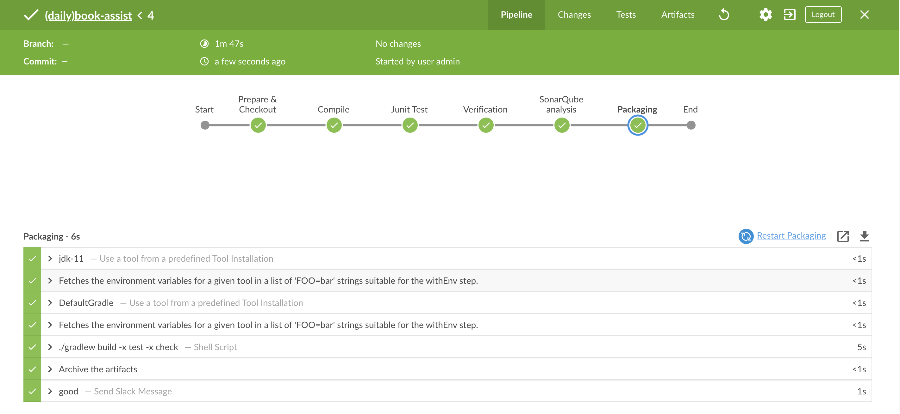
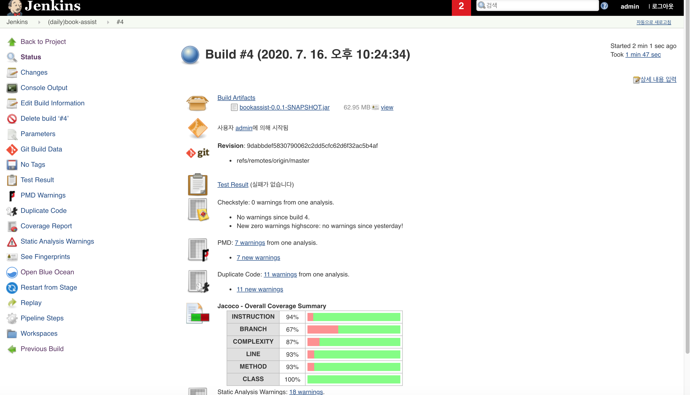
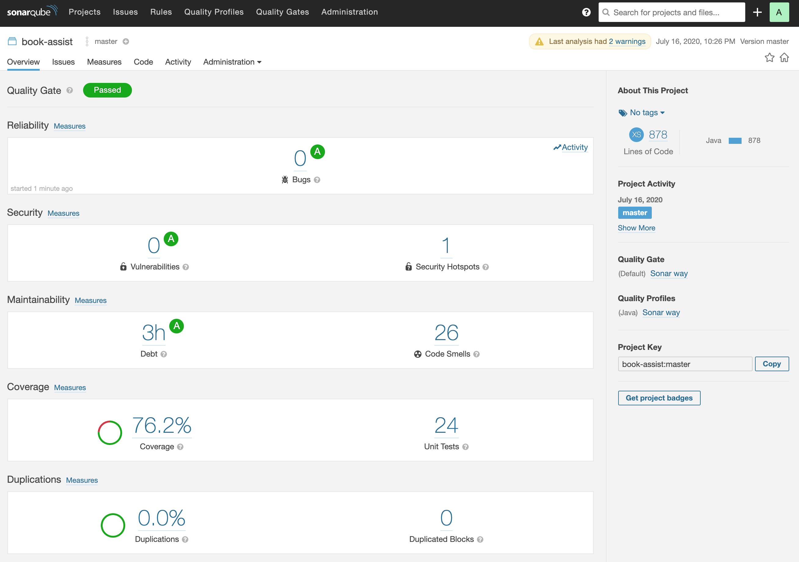

## Jenkins Pipeline 실행
  - Jenkins job - (daily)book-assist
    - polling SCM 설정 (15분애 한번씩) (cf. 실제 개발 시에는 dev 브랜치를 하루에 한번 돌리고 CD 환경과 엮어서 개발서버에 자동 배포하는 것도..)
    - git 소스폴더 root 경로의 Jenkinsfile 을 통해 DSL 을 이용한 pipeline job 을 jenkins 에서 실행
    - stages 는 checkout / compile / test / quality metrics / sonarqube 분석 / packaging 으로 나뉘고 build 결과는 slack 메시지 전송 
    - parameterized job -> branch 파라메터 설정 가능
  - build 실행 중 Open Blue Ocean 을 통해 유려한 UI 의 pipeline 실행 상태 확인 가능
  - jenkins job #build 화면에서는 빌드 결과의 Test / Checkstyle / PMD / CPD / Jacoco report 확인 가능
  - jenkins job 화면에서는 마지막 SonarQube 분석 상태의 sonar project 를 확인할 수 있는 링크 아이콘 존재
  - slack 메시지의 링크를 눌러 빌드 성공/실패의 상세 사항을 쉽게 확인 가능
  - 
  - 
  - 

## Sonarqube 분석 결과
  - lombok generated code 는 test coverage 에서 제거하기 위한 lombok.config 설정 필요
  - 
  - cf.) 소스 프로젝트에서 직접 sonarqube 연동 분석 가능

## book_assist_env.zip (corretto jdk11, jenkins, sonarqube installation - OSX only)
  - 아래 구글 드라이브 public download link 를 내려받아 local mac pc 의 home 폴더 아래 압축을 풀면 제가 셋팅한 jenkins, sonarqube 를 그대로 확인할 수 있습니다. 
  - https://drive.google.com/file/d/1_kmxNrzZPD6HMi2JXsE_NYOokTIn5Qe1/view?usp=sharing 
  - jenkins, sonarqube 의 관리자 계정은 모두 admin / admin 입니다.
  - slack 연동은 woos-sre.slack.com (Woos SRE Project) 라는 workspace 를 생성하여 Jenkins CI app 을 #general 채널에 설정하였습니다. 
